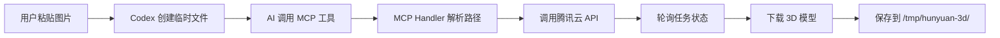

# Hunyuan MCP 技术实现文档

## 📌 项目概述

Hunyuan MCP Server 是一个基于 Model Context Protocol (MCP) 的服务器，用于集成腾讯云 Hunyuan-3D API，支持通过文本或图片生成高质量的 3D 模型。

## ✅ 核心功能

### 1. 剪贴板图片自动处理（Data URL 直传方案）
- **问题场景**：用户在 Codex 中粘贴图片后，AI 需要将其传递给 MCP 工具
- **核心发现**：Codex 已将图片转换为 data URL 并传给 AI，无需查找文件
- **最优解决方案**：
  - 在 `core/src/tools/handlers/mcp.rs` 中实现 `extract_recent_image_from_session` 函数
  - 直接从会话历史中提取 Codex 已准备好的 data URL
  - AI 调用工具时可以不传 `image_url` 参数，系统会自动注入
  - 备用方案：`auto_resolve_clipboard_path` 在本地查找文件

### 2. 统一文件存储管理
- **设计决策**：所有生成的 3D 模型强制保存到统一位置
- **实现细节**：
  - 默认路径：`/tmp/hunyuan-3d/`
  - 目录格式：`{时间戳}_{job_id前8位}_download/`
  - 在 `src/tools/download.rs` 中忽略任何传入的 `output_dir` 参数
  - 确保文件组织清晰，便于查找和管理

### 3. MCP 协议集成
- **支持的工具**：
  - `hunyuan_generate_3d`：生成 3D 模型
  - `hunyuan_query_task`：查询任务状态
  - `hunyuan_download_results`：下载生成结果
- **工具描述优化**：明确指导 AI 如何正确使用各个参数

## 📂 项目结构

### 源代码组织
```
hunyuan-mcp-server/
├── src/
│   ├── main.rs                 # MCP 服务器入口
│   ├── message_processor.rs    # 消息处理器
│   ├── image_utils.rs         # 图片处理工具
│   ├── tools/                 # MCP 工具实现
│   │   ├── mod.rs             # 工具注册和分发
│   │   ├── generate.rs        # 3D 生成工具
│   │   ├── query.rs           # 状态查询工具
│   │   └── download.rs        # 结果下载工具
│   └── tencent_cloud/         # 腾讯云 API 客户端
│       ├── auth.rs            # API 签名认证
│       └── client.rs          # HTTP 客户端
└── Cargo.toml

core/src/tools/handlers/
└── mcp.rs                     # MCP 处理器（含路径解析）
```

### 运行时文件位置
```
/tmp/
├── codex-clipboard-xxx.png    # 用户粘贴的临时图片
└── hunyuan-3d/                # 生成的 3D 模型
    └── {时间戳}_{job_id}_download/
        ├── *.glb              # GLB 格式（推荐）
        ├── *.obj + *.mtl      # OBJ 格式及材质
        └── texture_*.png      # PBR 贴图
```

## 🔧 技术实现细节

### 1. 路径自动解析算法
```rust
fn auto_resolve_clipboard_path(input: &str) -> Option<String> {
    // 1. 检查是否为 codex-clipboard 文件
    if !input.contains("codex-clipboard") {
        return None;
    }
    
    // 2. 提取文件名（处理各种输入格式）
    let file_name = Path::new(input)
        .file_name()
        .and_then(|n| n.to_str())
        .unwrap_or(input);
    
    // 3. 在系统临时目录搜索
    let temp_path = std::env::temp_dir().join(file_name);
    if temp_path.exists() {
        return Some(temp_path.to_string_lossy().to_string());
    }
    
    // 4. 备用位置搜索
    for fallback in &["/tmp", "/private/tmp"] {
        let path = Path::new(fallback).join(file_name);
        if path.exists() {
            return Some(path.to_string_lossy().to_string());
        }
    }
    
    None
}
```

### 2. 图片处理流程
- **输入格式支持**：
  - Base64 字符串
  - Data URL (data:image/...)
  - 本地文件路径
  - 远程 URL
- **自动检测**：使用 `ImageSource::detect()` 智能识别输入类型
- **验证机制**：
  - 文件大小限制：20MB
  - 格式支持：PNG, JPEG, WebP
  - 分辨率检查

### 3. API 集成
- **认证方式**：TC3-HMAC-SHA256 签名算法
- **并发控制**：自动重试和轮询机制
- **错误处理**：详细的错误信息和日志记录

## 🚀 工作流程



## 📊 性能优化

- **路径缓存**：避免重复文件系统访问
- **异步处理**：使用 Tokio 异步运行时
- **流式下载**：大文件分块下载，减少内存占用
- **智能轮询**：根据任务状态动态调整轮询间隔

## 🔒 安全考虑

- **路径验证**：防止路径遍历攻击
- **文件大小限制**：防止资源耗尽
- **API 密钥管理**：使用环境变量存储敏感信息
- **临时文件清理**：自动清理过期的临时文件

## 📝 使用示例

### 配置环境变量
```bash
export TENCENTCLOUD_SECRET_ID="your_secret_id"
export TENCENTCLOUD_SECRET_KEY="your_secret_key"
export RUST_LOG=info
```

### 启动 MCP 服务器
```bash
cargo run --release -p hunyuan-mcp-server
```

### 在 Codex 中使用
1. 粘贴图片（Ctrl+V）
2. AI 自动调用：`hunyuan_generate_3d(image_url="codex-clipboard-xxx.png")`
3. 系统自动处理路径和生成 3D 模型

## 🎯 关键创新点

1. **透明路径解析**：用户和 AI 无需关心文件实际位置
2. **统一存储管理**：所有输出集中管理，便于查找
3. **智能类型检测**：自动识别各种图片输入格式
4. **健壮错误处理**：优雅处理各种异常情况

## 📈 未来改进方向

- [ ] 支持批量图片处理
- [ ] 添加模型预览功能
- [ ] 实现自动清理策略
- [ ] 支持更多 3D 格式输出
- [ ] 添加质量优化选项
